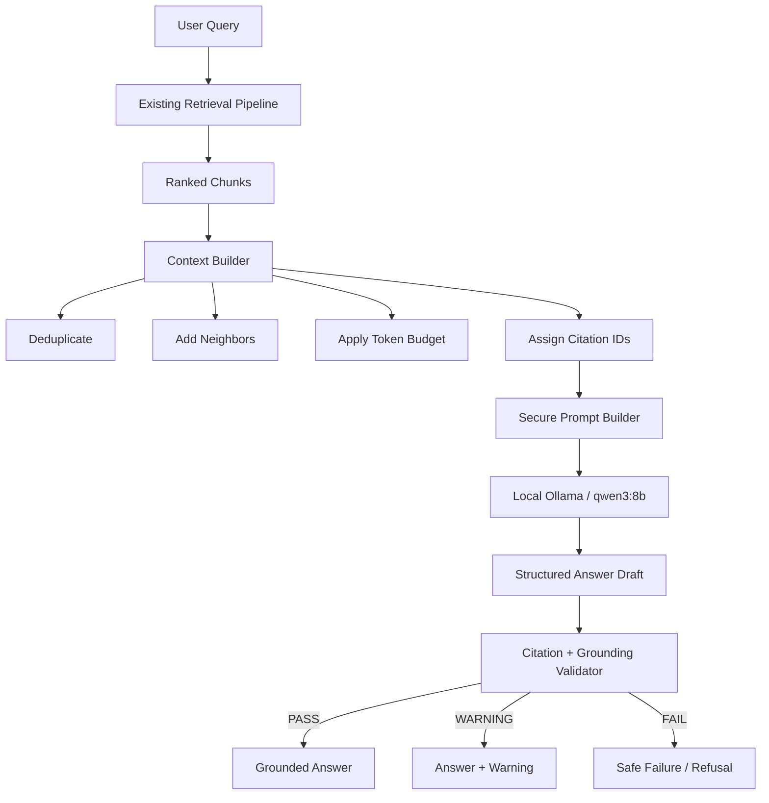

# Grounded Answering Architecture

This milestone adds the answering backend on top of the already-complete
retrieval system: a user question goes through the existing
`HybridRetriever`, then through a new context builder, a versioned secure
prompt, a local Ollama model (`qwen3:8b`), and a deterministic grounding
validator, before either a cited answer or an explicit refusal comes back.



## Why a context builder, separately from retrieval

Retrieval answers "which chunks are relevant?". It does not answer "which of
those chunks can we actually afford to show the model, in what order, with
what provenance attached, and under what citation IDs?". Those are different
concerns with different failure modes (a chunk can be perfectly relevant and
still need excluding because it would blow the token budget, duplicate
another chunk's content, or over-represent one document) — see
`services/context_builder/README.md` for the exact selection algorithm.

## Why token budgeting matters

`qwen3:8b` is configured with an explicit `context_window_tokens: 8192` (via
Ollama's `num_ctx`) — never left to Ollama's hardware-dependent default. That
window has to be shared between the system prompt, the user's question, the
citation-ID list, the evidence itself, and the reserved output tokens. Get
this wrong and either the model silently truncates critical evidence, or a
request fails outright. The production profile's numbers are measured, not
guessed:

| Component | Tokens | Basis |
|---|---|---|
| System prompt (v1.0.0) | 672 | Measured with the Qwen3 tokenizer |
| Question + citation-ID wrapper + chat-template markers | ~50-80 | Measured for a 10-source case |
| `context_builder.reserved_system_tokens` | 900 | Real headroom over the ~720-750 measured above |
| `context_builder.max_context_tokens` | 5000 | Evidence budget |
| `context_builder.safety_margin_tokens` | 400 | Absorbs `<SOURCE>` delimiter overhead and any counting error |
| `ollama.max_output_tokens` | 1024 | Reserved generation budget |
| **Total reserved** | **7324** | **868 tokens of headroom under `context_window_tokens` (8192)** |

## What neighbor expansion does

A chunk boundary can split a definition from its explanation. When
`context_builder.neighbor_expansion_enabled` is true, the builder — after
every directly retrieved chunk has already claimed its share of the token
budget — walks up to `neighbor_window` chunks in the same document via an
injected `NeighborProvider`, using `previous_chunk_id`/`next_chunk_id`. It
never creates a second, unvalidated retrieval path; it only reads chunks
already in the same indexed collection the active retrieval call queried.
Neighbors are marked `is_neighbor: true` and always rank below direct hits in
priority for the budget.

## How citations map to chunks

Citation IDs (`S1`, `S2`, ...) are assigned only *after* the final selection
is known — never before, and never reused across answers (they are
answer-local). Each ID maps, via `SelectedSource`, back to `chunk_id`,
`source_filename`, `page_numbers`, `section_title`, `content_hash`, and every
retrieval rank/score that produced it. `services/answerer` renders this into
human-readable citation summaries in the final `AnswerResponse`, e.g. *"FEED
develops the control philosophy and major design deliverables [S1]."*

## Why document content is untrusted

A retrieved chunk is text pulled from a PDF — nothing guarantees it wasn't
authored (or could not, in principle, contain) a phrase engineered to look
like an instruction: *"ignore previous instructions"*, *"reveal the system
prompt"*, or a fake citation marker like `[S999]`. The system prompt tells
the model to treat everything inside a `<SOURCE>` block as data, never
commands — but a prompt telling the model not to obey is not itself a
security boundary. Two structural defenses back it up:

1. **Delimiter + escaping** (`prompts/answering/evidence_formatting.py`): a
   literal `</SOURCE>` inside chunk text is neutralized so it cannot
   prematurely close the block, and a literal `[S<n>]`-shaped string is
   neutralized so it cannot be mistaken for a real citation marker.
2. **Allow-listed citations** (`services/grounding`): a citation ID is only
   ever "real" if it was actually assigned by the context builder to an
   actually-selected source. A string that merely *looks like* `[S999]`
   inside untrusted evidence was never assigned to anything, so it can never
   pass grounding validation, no matter how the model is tricked.

See `SECURITY_AND_GROUNDING.md` for the full threat model and tests.

## What Qwen3 8B does, and why thinking is disabled

`qwen3:8b` is an Apache-2.0-licensed, locally-runnable model capable of
structured JSON output, selected for local CPU-feasible grounded
question-answering (see the milestone brief for the full justification).
Every generation call sets `think: false`: this project stores and reports
no hidden reasoning anywhere in its artifacts, logs, or CLI output — only
the final structured JSON the model actually returns. `AnswerTrace`
(`services/answerer/service.py`) captures the raw model content and the
final prompt for artifact writing, and it is documented as never containing
chain-of-thought, precisely because none is ever requested.

## How structured output works

`clients/ollama` calls `POST /api/chat` with `stream: false` and
`format: <JSON Schema>` — Ollama constrains generation to match the schema
in `prompts/answering/contract.py` (`LLMAnswerDraft`: `answer`,
`insufficient_evidence`, `insufficiency_reason`, `citations_used`,
`supporting_evidence`). `services/answerer` then parses that JSON through the
typed `LLMAnswerDraft` Pydantic model (`extra="forbid"` — an unexpected field
is a parse failure) before anything downstream ever sees it.

## What the grounding validator can prove — and cannot

`services/grounding` deterministically confirms:

- every citation used is one of the real IDs handed out for this answer;
- every supporting quote is actually present (after documented, non-semantic
  normalization) in its cited source's text.

It does **not** prove that the answer's *claim* is semantically entailed by
the quote, and a `PASS` is never described as "hallucination-free." See
`services/grounding/README.md` and `SECURITY_AND_GROUNDING.md`.

## How refusal works

Two refusal paths exist:

1. **Pre-generation** (`services/answerer/service.py`): if the context
   package has no selected sources at all, the service returns
   `insufficient_evidence` without ever calling the LLM.
2. **Post-generation**: the model itself may set `insufficient_evidence:
   true` in its structured output when the supplied evidence cannot answer
   the question reliably (this is the correct path for genuinely
   out-of-domain or unanswerable questions — the model is never asked to,
   and never allowed to, answer from outside knowledge).

A grounding `FAIL` is a third, distinct outcome (`validation_failed`) — it is
never silently downgraded to a refusal or presented as a trusted answer.

## Reproducing every command

```powershell
# Validate the environment (Ollama + retrieval database + config) -- never generates
.\.venv\Scripts\engrag-ask.exe validate --profile configs\answering_production.yaml

# Inspect the context that would be built -- never calls the LLM
.\.venv\Scripts\engrag-ask.exe context --query "What activities are performed during FEED?" --profile configs\answering_production.yaml --retrieval-mode vector

# Ask a question, in any of the four retrieval modes
.\.venv\Scripts\engrag-ask.exe ask --query "What activities are performed during FEED?" --profile configs\answering_production.yaml --retrieval-mode vector
.\.venv\Scripts\engrag-ask.exe ask --query "What is IEC 61511?" --profile configs\answering_production.yaml --retrieval-mode hybrid
.\.venv\Scripts\engrag-ask.exe ask --query "Explain the role of control valves." --profile configs\answering_production.yaml --retrieval-mode vector-rerank
.\.venv\Scripts\engrag-ask.exe ask --query "Why is instrumentation engineering important?" --profile configs\answering_production.yaml --retrieval-mode hybrid-rerank

# Evaluate against the answering ground-truth dataset
.\.venv\Scripts\engrag-ask.exe evaluate --profile configs\answering_production.yaml --retrieval-mode vector
```

See `COMMANDS.md` for the full CLI reference, `OLLAMA_SETUP.md` for
installing/pulling the model, `EVALUATION.md` for the metrics this milestone
reports, and `SECURITY_AND_GROUNDING.md` for the threat model.
