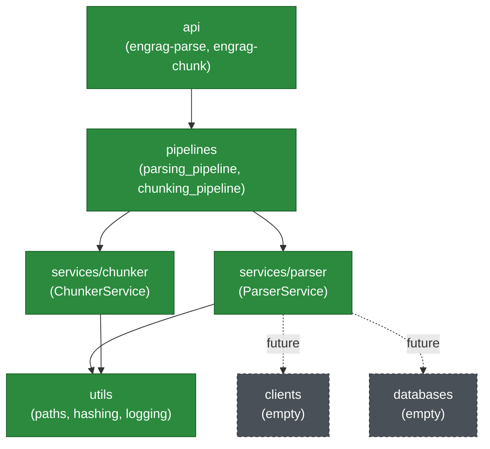

# Service architecture

This document explains the service-oriented structure of `src/engineering_rag/`,
introduced by the restructure recorded in
[`service_restructure_plan.md`](service_restructure_plan.md) and
[`RESTRUCTURE_COMPLETION_REPORT.md`](../../RESTRUCTURE_COMPLETION_REPORT.md).
For the parser service's own internal module responsibilities and data flow,
see [`docs/architecture.md`](../architecture.md).

## Why services

A RAG system is not one program; it is a chain of independent capabilities —
parse, chunk, embed, store, retrieve, rerank, generate — each with its own
inputs, outputs and failure modes. Building them as one undifferentiated
package makes it impossible to test, deploy or reason about them separately,
and it is exactly how a Docling upgrade or a chunking-library change ends up
touching code that has nothing to do with either.

So every major capability is an **isolated service** under `services/`, with
its own public interface, its own tests, and its own internal module
structure. `services/parser/` and `services/chunker/` are both implemented.
`clients/`, `databases/`, `prompts/` are empty boundaries reserved for
milestones that have not started.

## Every top-level package

```text
src/engineering_rag/
├── api/           user/system entry points — the engrag-parse and engrag-chunk CLIs
├── clients/       future boundary: embedding/reranker/LLM/remote-model clients (empty)
├── databases/     future boundary: ChromaDB, metadata store, repositories (empty)
├── pipelines/     orchestration only — coordinates one or more services
├── prompts/       future boundary: retrieval/generation prompt templates (empty)
├── services/
│   ├── parser/    COMPLETE — PDF parsing, validation, artifact generation
│   └── chunker/   COMPLETE — hierarchical + conditional-recursive chunking, validation
└── utils/         generic, service-agnostic helpers (paths, hashing, logging)
```

| Package | Owns | Status |
|---|---|---|
| `api` | CLIs (`cli.py` for `engrag-parse`, `chunker_cli.py` for `engrag-chunk`); a future HTTP interface would live here too | Implemented |
| `pipelines` | Orchestration functions that call one or more services in sequence | Implemented (`parsing_pipeline.py`, `chunking_pipeline.py`) |
| `services/parser` | Everything PDF-parsing-domain: config, preflight, Docling conversion, export, validation, artifacts | Implemented, complete |
| `services/chunker` | Hierarchical-first, tokenizer-aware, conditionally-recursive chunking of `document.json`; see `docs/chunker/` | Implemented, complete |
| `clients` | Adapters to external model/service endpoints | Empty boundary |
| `databases` | Adapters to vector stores / metadata stores | Empty boundary |
| `prompts` | LLM prompt templates for retrieval/generation | Empty boundary |
| `utils` | `paths.py` (safe filenames, default data roots), `hashing.py` (streamed SHA-256), `logging.py` (centralized stdlib logging) | Implemented |

## Allowed dependency direction



Rule: **`api -> pipelines -> services -> utils`**, plus `services -> clients`
and `services -> databases` once those are implemented. Never the reverse of
any arrow, and never `services/parser <-> services/chunker` — sibling
services do not import each other; they communicate only through files on
disk (`data/output/parser/.../docling/document.json` is the chunker's actual
input, read via `services/chunker/loader.py`, never a direct Python import
of `services.parser`).

This is enforced by
`tests/unit/test_architecture.py::TestServiceArchitectureBoundaries`, which
statically checks every import in `utils/`, `services/` and `pipelines/` and
fails the build on a violation, plus an isolated-subprocess import of every
top-level package to catch a circular import that a partial static check
could miss.

## The parser service's public contract

```python
from engineering_rag.services.parser import ParserConfig, ParserRequest, ParserResult, ParserService

request = ParserRequest(pdf_path=Path("data/input/doc.pdf"), config=ParserConfig())
result: ParserResult = ParserService().run(request)

result.status  # RunStatus.PASS | PASS_WITH_WARNINGS | FAIL
result.run_dir  # Path to the immutable run directory
result.report  # ValidationReport — checks, evidence, human_review_items
result.manifest  # SourceManifest — the independent preflight baseline
result.timings  # per-stage wall-clock seconds
result.exit_code  # 0 or 1, for a CLI/CI caller
```

Callers outside `services/parser` should depend on this surface
(`engineering_rag.services.parser`) only. Internal modules (`converter`,
`inventory`, `profiles`, `exporters`, `artifacts`, `preflight`,
`normalization`, `validation.*`) remain importable — the test suite exercises
each individually — but they are implementation detail, not the contract.

## Pipeline orchestration

`pipelines/parsing_pipeline.py::run_parsing_pipeline(pdf_path, config,
output_root=None)` builds a `ParserRequest` (defaulting `output_root` to
`utils.paths.default_parser_output_root()`, i.e. `data/output/parser`) and
calls `ParserService().run(request)`. It contains no PDF or Docling logic of
its own — `ParserService` owns the full preflight → profile → convert →
export → validate → manifest sequence, because that sequencing is
parser-domain behaviour, not generic orchestration. The pipeline module
exists as the stable entry point every caller (CLI, notebook, a future
worker) uses, so that a second service arriving later composes at this layer
without every caller needing to know both services' internals.

## Input/output structure

```text
data/
├── input/                          source documents (git-ignored)
│   └── ocr/                        OCR-benchmark fixtures (git-ignored)
└── output/
    ├── parser/<document>/<run-id>/     parser service runs (git-ignored)
    │   ├── source/manifest.json
    │   ├── docling/document.json
    │   ├── markdown/document.md
    │   ├── assets/
    │   ├── validation/
    │   ├── logs/                       run.jsonl (domain events) + engrag.log (operational log)
    │   └── run_manifest.json
    └── chunker/<document>/<run-id>/    chunker service runs (git-ignored)
        ├── chunks.jsonl
        ├── manifest.json
        ├── validation_report.json
        ├── chunking_summary.md
        └── logs/chunker.log
```

Defaults are resolved lazily via `engineering_rag.utils.paths` (never a
module-level constant computed at import time), so nothing depends on the
process's working directory at import time — only at the moment a path is
actually used, same as any other relative path this project writes. The CLI's
`--artifacts` option (on `run`) and `ParserRequest.output_root` both accept an
explicit override, and `validate`/`show` accept any existing run directory
via `--run` regardless of where it lives — including a directory produced
under the pre-restructure `artifacts/` root.

## Logging architecture

Centralized in `utils/logging.py`, configured **once**, at the application
boundary (`api/cli.py::_setup_logging`, called from each CLI command). Every
other module only ever does:

```python
import logging

logger = logging.getLogger(__name__)
```

and never calls `logging.basicConfig()` — enforced by
`test_logging_is_configured_only_at_the_application_boundary`.

- **Console handler**: stderr, default `INFO`, silenced to `ERROR` under
  `--json` so stdout stays machine-parseable.
- **Per-run file handler**: `ParserService.run()` attaches one at
  `<run_dir>/logs/engrag.log` (default `DEBUG`) the moment the run directory
  exists, and detaches it when the run ends (success or failure) — so every
  completed run carries its own operational log, and handlers never
  accumulate across runs in a long-lived process.
- **Explicit `--log-file`**: `inspect`/`run` also accept `--log-file <path>`
  for an additional, caller-chosen log destination.
- **Context**: a shared `RunContextFilter` injects `run_id` / `document_id` /
  `stage` onto every record once bound (`bind_run_context`), so the existing
  `logger.info(...)` calls throughout `preflight.py`, `converter.py`,
  `exporters.py`, `artifacts.py` etc. did not need to change to carry that
  context — the filter attaches it at the handler layer.
- **Optional JSONL formatting**: `configure_logging(..., jsonl=True)` /
  `attach_run_file_handler(..., jsonl=True)` write one JSON object per line
  (timestamp, level, logger, message, context, exception) instead of plain
  text.
- **UTF-8 on Windows**: `api/cli.py::_force_utf8_streams()` reconfigures
  `stdout`/`stderr` to UTF-8 before logging is configured, so a legacy
  console codepage cannot crash the process on a non-ASCII log line.

This is deliberately **separate** from
`services/parser/artifacts.py::JsonlLogger`, which predates this module and
records *domain* pipeline events (`run_started`, `conversion_complete`, ...)
into `logs/run.jsonl`. The two are complementary: `utils/logging.py` is
operational/diagnostic logging of what the code is doing; `JsonlLogger` is a
structured record of what the *pipeline* decided. Neither was removed or
silently duplicated by the other.

## Chunker boundary

`services/chunker/` is implemented — hierarchical-first, tokenizer-aware,
conditionally-recursive chunking of the parser's `docling/document.json`
into retrieval-ready `chunks.jsonl` with parent/child and merge lineage,
heading paths, and page/bbox provenance, under
`data/output/chunker/<document>/<run-id>/`. Full documentation:
[`docs/chunker/`](../chunker/) (`ARCHITECTURE.md`, `OUTPUT_SCHEMA.md`,
`CONFIGURATION.md`, `VALIDATION.md`, `MENTOR_EXPLANATION.md`,
`HYBRID_BASELINE_COMPARISON.md`). Per this milestone's explicit scope: no
embeddings, no vector database, no retrieval, no reranking, no chatbot.

## Future client/database/prompt boundaries

`clients/`, `databases/` and `prompts/` are empty boundary packages with only
a `README.md` each, describing what will eventually live there (external
model clients; vector-store/metadata adapters; LLM prompt templates
respectively). Nothing is implemented, and no placeholder/fake code was added
ahead of the milestones that need them.

## How to add a new service

1. Create `services/<name>/` with its own `__init__.py` exposing a small
   public interface (mirror `services/parser/__init__.py`: a `<Name>Service`
   class, a `<Name>Request`/`<Name>Result` pair, and the service's own
   exception types).
2. Keep the service's internal modules (config, models, the actual work) inside
   `services/<name>/` — do not reach into another service's internals, and do
   not import `pipelines` or `api` from inside a service.
3. Add `pipelines/<name>_pipeline.py` exposing a thin
   `run_<name>_pipeline(...)` that builds a request and calls the service.
4. Wire a CLI command (or reuse an existing one) in `api/cli.py` that calls
   the pipeline function — never the service directly.
5. If the service needs an external client or persistence, depend on
   `clients/`/`databases/`, not the other way around.
6. Add an architecture test asserting the new service does not import
   `pipelines` or `api`, alongside the existing ones in
   `tests/unit/test_architecture.py`.

## How to test a service

Mirror the service tree under `tests/`:

```text
tests/unit/services/<name>/            fast, no external model weights
tests/integration/services/<name>/     real model/library calls on synthetic fixtures, `@pytest.mark.integration`
tests/integration/pipelines/           full pipeline runs, `@pytest.mark.slow` for anything using the real acceptance document
```

Use synthetic, code-generated fixtures (see `tests/conftest.py`'s
ReportLab-built PDFs) so the suite runs without any confidential or
user-supplied input; gate anything needing cached model weights or an OCR
engine behind the `requires_docling_models` / `requires_rapidocr` markers in
`tests/conftest.py` so CI self-skips rather than downloading multi-hundred-MB
weights on every run.
