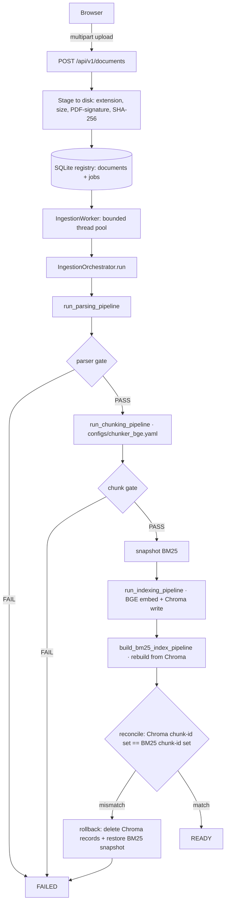
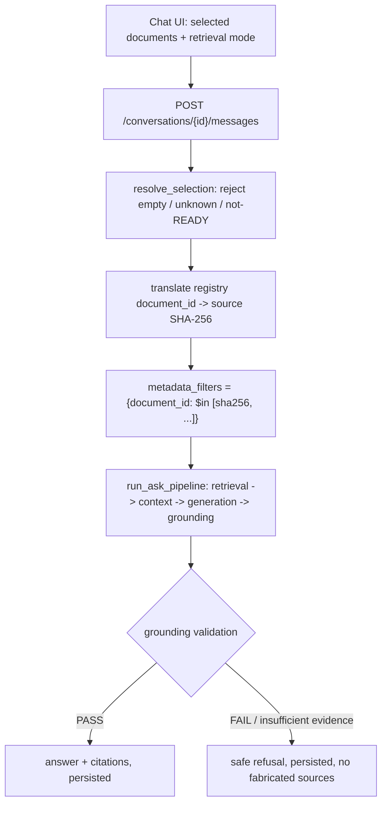

# Chatbot Architecture

Local, single-user document-ingestion RAG chatbot built on top of the
existing parser/chunker/embedder/retriever/answerer pipelines. The chatbot
adds a durable document/job registry, a FastAPI HTTP layer, and a React
frontend — it does not reimplement or fork any of the underlying RAG logic.

## Layering

```
apps/rag-chatbot/          React 18 + TypeScript + Vite (independent npm package)
        |  HTTP + SSE
src/engineering_rag/chatbot/   FastAPI app, registry, ingestion orchestrator, worker
        |  calls
src/engineering_rag/pipelines/ run_parsing_pipeline, run_chunking_pipeline,
                                run_indexing_pipeline, build_bm25_index_pipeline,
                                run_hybrid_search, run_ask_pipeline
        |  calls
src/engineering_rag/services/  parser, chunker, embedder, retriever, reranker,
                                answerer, grounding, context_builder
```

`chatbot` is an **api-tier** package (enforced by
`tests/unit/test_architecture.py::test_lower_tiers_do_not_import_the_chatbot`
and `test_chatbot_reuses_pipelines_rather_than_service_internals`): it may
call `pipelines`, never reach into `services` internals, and no lower tier
may import it back.

## Request flow (ingestion)



Every stage is timed and reported through `StageReporter`; progress is
pushed to subscribers over SSE via `ProgressBroker`.

## Request flow (asking a question)



## Document identity: a deliberate two-id design

This is the single most important design fact in this codebase, and the
source of the most serious defect real acceptance testing found (see
`docs/chatbot/COMPLETION_REPORT.md`).

- **Registry `document_id`** (`chatbot/models.py::DocumentRecord.document_id`)
  is this application's own bookkeeping id (a UUID-like hex string). It is
  what the API, the frontend, and conversation history use to refer to a
  document.
- **Pipeline document identity** is the source file's own **SHA-256**
  (`services/chunker/ids.py::document_id()` returns it unchanged). Every
  chunk written to Chroma and BM25 carries this SHA-256 in its
  `document_id` metadata field — a deliberately content-addressed identity
  that exists independently of this application and predates it.

Anywhere the chatbot queries or mutates Chroma/BM25 by document identity
(`IngestionOrchestrator.reconcile`/`rollback_document`, the delete endpoint,
the selected-document retrieval filter), it must translate through
`registry.get_document(id).sha256` first. Every such call site does this
today; see `answering.py::GroundedAnsweringService.answer` and
`ingestion.py::IngestionOrchestrator.run` for the canonical examples.

## Durable state

SQLite (`sqlite3`, no ORM — see `storage.py` module docstring for why),
WAL mode, an explicit `REGISTRY_SCHEMA_VERSION` guard. Three tables:
`documents`, `ingestion_jobs`, `conversations` (+ `conversation_messages`).

State machines (`states.py`) are enum-based with an explicit transition
table (`assert_transition`) — no free-form status strings. Restart recovery
(`Registry.recover_interrupted_jobs`) marks any job left in a non-terminal
state `INTERRUPTED`; only an explicit retry re-enters the pipeline, and an
interrupted document is never exposed to retrieval
(`RETRIEVABLE_DOCUMENT_STATES = frozenset({DocumentStatus.READY})`).

## Concurrency and consistency

- `IngestionWorker` runs a bounded thread pool (`concurrency=1` by default —
  Docling conversion, BGE embedding and the cross-encoder reranker are all
  resource-heavy; running two at once on a laptop makes both slower).
- A module-level `threading.RLock` (`ingestion.py::_INDEX_LOCK`) serializes
  every Chroma/BM25 mutation across the worker and the delete endpoint, so
  ingest/delete/reprocess cannot interleave writes.
- Activation to `READY` requires a passing cross-index reconciliation
  (`ReconciliationReport.consistent`: no ids missing from either index, and
  the document actually has chunks). A partial write is rolled back:
  Chroma records for that document are deleted by SHA-256
  (`databases/chroma/repository.py::delete_document_records`, scoped
  strictly to one document — never a full collection wipe) and the BM25
  index directory is restored from a pre-mutation snapshot taken before
  embedding began.

## Frontend

`apps/rag-chatbot/` — React 18, TypeScript strict
(`noUncheckedIndexedAccess`), Vite, Tailwind, shadcn-style components,
TanStack Query for server state, React Router (`HashRouter`), SSE hooks for
live job/answer progress. Entirely separate npm package; no Node
dependency is mixed into the Python package or its extras.

Routes: `/` (Chat), `/documents`, `/documents/:id`, `/system`.

## What this milestone deliberately does not add

- No authentication — this is local, single-user software bound to
  `127.0.0.1` by default (see `docs/chatbot/SECURITY.md`).
- No OpenAI provider — the answering-provider boundary
  (`answering.py::AnswerProvider` Protocol) is shaped so one could be added
  without touching retrieval, grounding, or the UI, but only Ollama is
  wired up.
- No Redis/Celery/Kafka/PostgreSQL — SQLite and an in-process thread pool
  are sufficient for one user on one machine.
