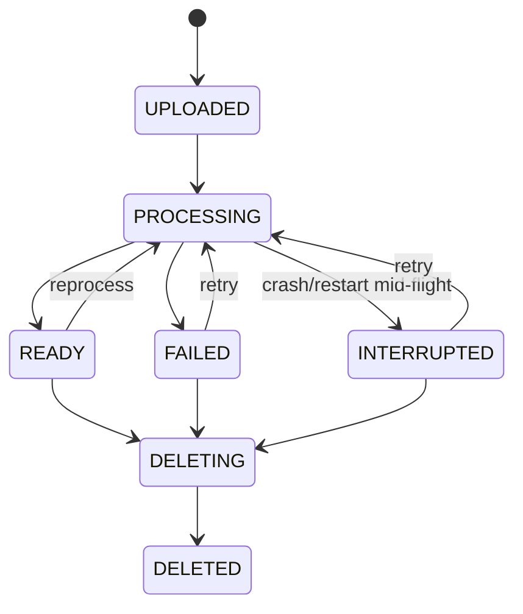

# Document Lifecycle

## States (`chatbot/states.py::DocumentStatus`)



Only `READY` is retrievable
(`RETRIEVABLE_DOCUMENT_STATES = frozenset({DocumentStatus.READY})`). Every
other state — including `PROCESSING` and `INTERRUPTED` — is invisible to
`resolve_selection()`, so a document can never be queried before it has
passed every validation gate.

Job states (`JobState`) and stages (`JobStage`) are tracked separately from
document status, because one document can accumulate several jobs over its
lifetime (an initial ingest, a reprocess, retries after failures).
`INGESTION_STAGE_ORDER` fixes the canonical stage sequence used for
progress percentages.

## Ingestion stages

```
QUEUED -> VALIDATING -> PARSING -> PARSER_VALIDATION -> CHUNKING ->
CHUNK_VALIDATION -> EMBEDDING -> VECTOR_INDEXING -> BM25_INDEXING ->
INDEX_VALIDATION -> ACTIVATION -> (READY)
```

Each stage is timed (`StageTiming`) and reported live over SSE
(`GET /jobs/{id}/events`). A gate failure at `PARSER_VALIDATION` or
`CHUNK_VALIDATION` stops the job immediately — no attempt is made to index
content that already failed validation.

## Upload

1. Streamed to a **staging** directory, never straight to the durable
   uploads directory (`chatbot/uploads.py::stage_upload`).
2. Validated **while streaming**, in this order: extension (`.pdf` only) →
   declared content-type → size-so-far against `max_upload_bytes` (default
   100 MiB) → `%PDF-` signature on the staged bytes → SHA-256.
3. Filenames are sanitized and never used as a storage path component —
   every staged/stored file gets a hashed/generated name, closing
   path-traversal regardless of what the original filename contained (see
   `docs/chatbot/SECURITY.md`).
4. Only after every check passes is the file promoted from staging to the
   durable uploads directory (`promote_staged_upload`) and a `documents`
   row created. A failed validation discards the staged file and never
   touches durable storage.

## Ingestion

Handled by `IngestionOrchestrator.run()` (see
`docs/chatbot/ARCHITECTURE.md` for the full stage diagram and the rollback
contract). In short: parse → validate → chunk → validate → snapshot BM25 →
embed + write Chroma → rebuild BM25 → reconcile Chroma against BM25 →
activate. Any failure after the Chroma write triggers rollback: this
document's Chroma records are deleted (scoped by SHA-256, never a
collection-wide operation) and the BM25 index directory is restored from
the pre-mutation snapshot.

## Retry

`POST /jobs/{id}/retry` is only accepted for jobs in `FAILED`, `CANCELLED`,
or `INTERRUPTED` state (`is_retryable_state`). A retry re-runs the full
pipeline from a clean artifact set; because activation requires a passing
reconciliation regardless of how many times it's attempted, retrying a job
that already succeeded is a safe no-op rather than a duplicate index entry.

## Cancel

`POST /jobs/{id}/cancel` sets a cancellation flag checked between pipeline
stages (`IngestionOrchestrator._check_cancelled`), not mid-stage — a
running Docling conversion or embedding batch always finishes before the
job stops, so cancellation never leaves a half-written stage's output on
disk. A cancelled job whose Chroma write had already happened is rolled
back exactly like a failure.

## Reprocess

`POST /documents/{id}/reprocess` bumps the document's `version` and submits
a new `REPROCESS` job through the same orchestrator, optionally with a
different `parser_profile`. Existing chunks are not removed until the new
run's activation succeeds — a reprocess that fails leaves the previous
`READY` state's index content untouched by design (activation is the only
mutation of "what's live").

## Delete

`DELETE /documents/{id}`:

1. Marks the document `DELETING`, then `DELETED` with `deleted_at` set —
   a soft delete; the registry row is retained, not dropped.
2. Removes the document's chunks from Chroma
   (`delete_document_records`, scoped by the document's source SHA-256)
   and rebuilds BM25 from the resulting Chroma state.
3. Historical conversation messages that cited this document are **never
   rewritten** — their citation metadata (quote, page, section) stays
   exactly as the user saw it. Only `source_available` (recomputed on
   every read) flips to `false`, so the UI can flag "this source was
   removed" without falsifying what was actually cited at the time.
4. A deleted document cannot be selected for a new question
   (`resolve_selection` treats `is_deleted` the same as "unknown
   document").

There is no restore endpoint in this milestone: once a document's chunks
are removed from the index, restoring it means re-ingesting the original
file (still present in the durable uploads directory unless explicitly
cleaned up) through `reprocess`, not resurrecting stale index state.
