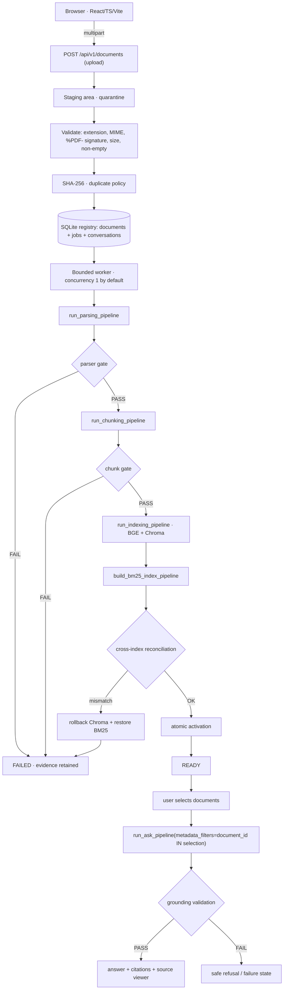
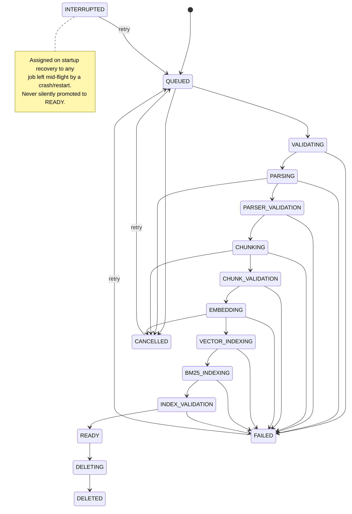

# Professional RAG Chatbot — Implementation Plan

**Branch:** `feature/professional-rag-chatbot`
**Baseline commit:** `5bda069` (master, "Merge pull request #6 from
nnourmmohamedd/feature/context-grounded-answering")
**Plan date:** 2026-08-26

---

## 1. Audited baseline (verified directly, not assumed)

| Claim from the brief | Verification | Result |
|---|---|---|
| PR #6 merged into master | `gh pr view 6` → `MERGED` at 2026-08-26T17:02:08Z | ✅ confirmed |
| Master merge commit `5bda069` | `git log origin/master --oneline -1` | ✅ confirmed |
| Production model `qwen3:4b`, digest `359d7dd4…30e7` | `configs/answering_production.yaml` | ✅ confirmed |
| `think: false`, `temperature: 0`, `seed: 42`, `num_ctx: 4096`, `num_predict: 512`, `read_timeout: 240`, `strict_digest: true` | `configs/answering_production.yaml` | ✅ confirmed |
| Grounding gates strict (inline citations, quotes, unknown-citation fail, quote-mismatch fail) | `configs/answering_production.yaml` `grounding:` block | ✅ confirmed |
| Four retrieval modes | `_MODE_TOGGLES` in `pipelines/answering_pipeline.py` | ✅ confirmed |
| Collection `engineering_documents_v1`, 122 chunks | `engrag-ask validate` → `collection count = 122` | ✅ confirmed |
| Embedder `BAAI/bge-base-en-v1.5`, reranker `BAAI/bge-reranker-base` | `configs/retrieval_production.yaml` | ✅ confirmed |
| Fast suite 834 passed, coverage 86.90% | local run | ✅ confirmed |
| Pre-existing diff on `docs/chunker/_generated/retrieval_readiness_report.json` is line-ending-only | `git diff --ignore-all-space --ignore-blank-lines` → **zero** output lines | ✅ confirmed line-ending-only, **no semantic change** |

**Handling of the unrelated file:** it is *not* staged, *not* committed, and
*not* discarded. It was moved to `git stash` before branching off master so
the feature branch starts from a clean tree; it remains recoverable via
`git stash list` / `git stash pop`.

### Repository instruction files

No `AGENTS.md`, `CLAUDE.md`, or `.cursorrules` exist. The governing
conventions are therefore the ones encoded in the repository itself:
`docs/architecture/service_architecture.md`, the per-service `README.md`
files, `pyproject.toml`'s tool config, and `.github/workflows/ci.yml`.

### Enforced dependency direction (must not be violated)

```
api  ->  pipelines  ->  services  ->  utils
```
From `pipelines/__init__.py`: a pipeline may depend on services and utils;
it must **never** be imported by a service, and must never duplicate work a
service already owns. The new FastAPI layer is an **`api`-tier** component:
it may call `pipelines`, never reach past them into service internals.

### Existing contracts the chatbot will reuse (no duplication)

| Stage | Reused entry point | Key types |
|---|---|---|
| Parsing | `pipelines.parsing_pipeline.run_parsing_pipeline(pdf_path, config, output_root)` | `ParserConfig`, `ParserResult{run_dir,status,report,manifest,timings}` |
| Chunking | `pipelines.chunking_pipeline.run_chunking_pipeline(input_path, config, output_root)` | `ChunkerConfig` |
| Indexing | `pipelines.indexing_pipeline.run_indexing_pipeline(input_path, config, rebuild=, embedder=)` | `IndexingRequest`, `IndexingResult`, `IndexingInputError` |
| BM25 | `pipelines.retrieval_pipeline.build_bm25_index_pipeline(config, force=)` | `BM25Config` |
| Retrieval | `pipelines.retrieval_pipeline.run_hybrid_search(query, config, top_k=, bm25_enabled=, reranker_enabled=, metadata_filters=, ...)` | `RetrievalResponse` |
| Answering | `pipelines.answering_pipeline.run_ask_pipeline(query, answering_config, retrieval_config, retrieval_mode=, ...)` | `AnswerResponse`, `AnswerTrace`, `GroundingReport` |
| Validation | `pipelines.answering_pipeline.validate_all(...)` | `AnsweringValidationReport` |

`ParserService.run`'s docstring already names "a future FastAPI worker" as an
intended caller — this milestone is that caller.

**Supported upload format: PDF only.** `services/parser/preflight.py` is
built on `pypdf`/`pdfminer.six`/`pypdfium2` and admits PDFs only. The UI must
advertise PDF only (the brief forbids advertising unsupported formats).

**Parser profiles** come from `services/parser/config.Profile`:
`default`, `high_fidelity`, `scanned`, `auto` — surfaced through a
capabilities endpoint, never hard-coded in the frontend.

---

## 2. Two verified integration gaps (surgical fixes required)

These are real defects for this milestone's requirements, found by reading
the code — not speculative refactors.

### Gap A — `run_ask_pipeline` hard-codes an empty metadata filter

`pipelines/answering_pipeline.py:314` calls `run_hybrid_search(...,
metadata_filters={}, ...)`. There is no way to scope an answer to selected
documents. **Fix:** thread an optional `metadata_filters` parameter through
`run_context_pipeline`/`run_ask_pipeline` down to the existing
`run_hybrid_search` call. Default stays `{}`, so every existing caller and
test is unaffected.

### Gap B — filters support only scalar equality, not multi-document selection

`services/retriever/filters.build_where_clause` refuses non-scalar values and
emits `{key: value}` / `{"$and": [...]}`. `bm25_retriever._matches_filters`
compares with `str(...) == str(...)`. Selecting **multiple** documents
requires `document_id ∈ {…}`.

**Fix:** extend both to support a list/tuple of scalars, translating to
Chroma's native `{"field": {"$in": [...]}}` and to a membership test in
BM25. This is an additive extension of an existing contract, keeps the
allow-list check intact (`document_id` is already in
`allowed_metadata_filter_fields`), and preserves the module's deliberate
refusal of JSON-encoded list fields such as `page_numbers`.

**Non-negotiable:** retrieval must be *restricted at query time* in both
Chroma and BM25. Retrieving globally and filtering afterwards is explicitly
forbidden and will be proven impossible by adversarial tests.

---

## 3. Target architecture



### Ingestion state machine



### Transactional boundaries and failure behavior

1. **Upload is not ingestion.** A file reaching staging creates a `documents`
   row in `UPLOADED` plus a `QUEUED` job. Nothing touches Chroma/BM25 yet.
2. **Every stage gate is fail-closed.** A `FAIL` from a parser/chunk/index
   validation report stops the job; the pipeline never proceeds on a failed
   gate.
3. **Activation is the only path to READY**, and it requires: parser gate
   passed, chunk gate passed, Chroma contains exactly the expected chunk IDs
   for this document, BM25 corpus contains the same active set, and
   embedding-model/dimension/schema metadata match the profile.
4. **Rollback:** if Chroma write succeeds but BM25 fails (or reconciliation
   fails), the document's Chroma records are deleted by `document_id` and the
   previous BM25 index is restored from its pre-mutation copy. A document is
   never left active in one index and absent from the other.
5. **Restart recovery:** any job found in a non-terminal state at startup is
   marked `INTERRUPTED`, its evidence preserved, and its document is *not*
   exposed to retrieval. Only an explicit retry re-enters the pipeline.
6. **Idempotent retry:** a retry re-runs from a clean versioned artifact set
   and reconciles to the same end state; re-running a successful retry is a
   no-op rather than a duplicate index.
7. **Index mutation is serialized** by a process-level lock plus an on-disk
   lock file, so concurrent ingest/delete/reprocess cannot interleave writes
   to Chroma/BM25.

### Duplicate policy (explicit, per the brief)

| Situation | Behavior |
|---|---|
| Same SHA-256, existing doc `READY` | Return existing document (HTTP 200 + `duplicate_of`), unless `force_new_version=true` |
| Same SHA-256, job in flight | Return the active job (HTTP 200 + `job_id`) |
| Same filename, different SHA-256 | New distinct document, collision-safe storage path |

---

## 4. API surface (`/api/v1`)

| Group | Endpoints |
|---|---|
| System | `GET /health`, `GET /ready`, `GET /capabilities`, `GET /system/status` |
| Documents | `POST /documents`, `GET /documents`, `GET /documents/{id}`, `GET /documents/{id}/preview`, `POST /documents/{id}/reprocess`, `DELETE /documents/{id}`, `POST /documents/{id}/restore` |
| Jobs | `GET /jobs/{id}`, `GET /jobs/{id}/events` (SSE), `POST /jobs/{id}/retry`, `POST /jobs/{id}/cancel` |
| Conversations | `POST /conversations`, `GET /conversations`, `GET /conversations/{id}`, `PATCH /conversations/{id}`, `DELETE /conversations/{id}`, `POST /conversations/{id}/messages`, `GET /conversations/{id}/messages/{mid}/events` (SSE), `POST /conversations/{id}/messages/{mid}/cancel` |

Envelope: every error is a typed object `{error: {code, message, retryable,
correlation_id}}` with a stable machine-readable `code`. No tracebacks, no
filesystem paths, no secrets. Progress is delivered over **SSE** (standards
based, no extra infrastructure).

Binding: `127.0.0.1` by default; CORS restricted to the Vite dev origin.
No auth for this explicitly local single-user milestone — documented as
requiring authentication + HTTPS before any remote exposure.

---

## 5. Frontend plan (`apps/rag-chatbot/`)

React 18 + TypeScript (strict) + Vite + Tailwind + shadcn/ui + React Router +
TanStack Query + React Hook Form/Zod + lucide-react + Vitest/Testing Library +
Playwright + `react-markdown` with `rehype-sanitize` (raw HTML disabled).

Routes: `/` (Chat), `/documents`, `/documents/:id`, `/system`.

Node dependencies stay entirely inside `apps/rag-chatbot/` — never mixed into
the Python package or its extras.

---

## 6. Ordered work plan

1. Registry + state machine + migrations (SQLite), unit-tested. ✅ gate: state transitions
2. Upload validation + staging + SHA-256 + duplicate policy. ✅ gate: path-traversal/MIME/signature tests
3. Retriever `$in` extension (Gap B) + `metadata_filters` threading (Gap A), with adversarial isolation tests.
4. Ingestion orchestrator calling the existing pipelines, with rollback + reconciliation, tested against an **isolated temporary Chroma/BM25**, never the real corpus.
5. FastAPI app: system, documents, jobs, SSE progress.
6. Conversations + answering endpoints reusing `run_ask_pipeline`.
7. Frontend scaffold, API client, then Chat / Documents / Details / System views.
8. Frontend unit + component tests; Playwright E2E against a faked backend.
9. Accessibility + responsive QA with real rendered screenshots.
10. Real local acceptance against the real corpus (fingerprint first, restore after).
11. Docs (`docs/chatbot/*`), README links, `.env.example`, `.gitignore`.
12. CI: preserve the two Python jobs, add a pinned Node job.
13. Push branch, open PR against master, watch CI to green. **Do not merge.**

## 7. Explicit non-goals for this milestone

- No OpenAI provider implementation (interface designed for it; Ollama only enabled).
- No authentication/HTTPS (local single-user; documented as a prerequisite for remote use).
- No Redis/Celery/Kafka/PostgreSQL/cloud storage.
- No fabrication of human semantic review — the 20 answering cases stay `machine_candidate`.
- No lowering of any existing test, coverage, type, or CI gate.
