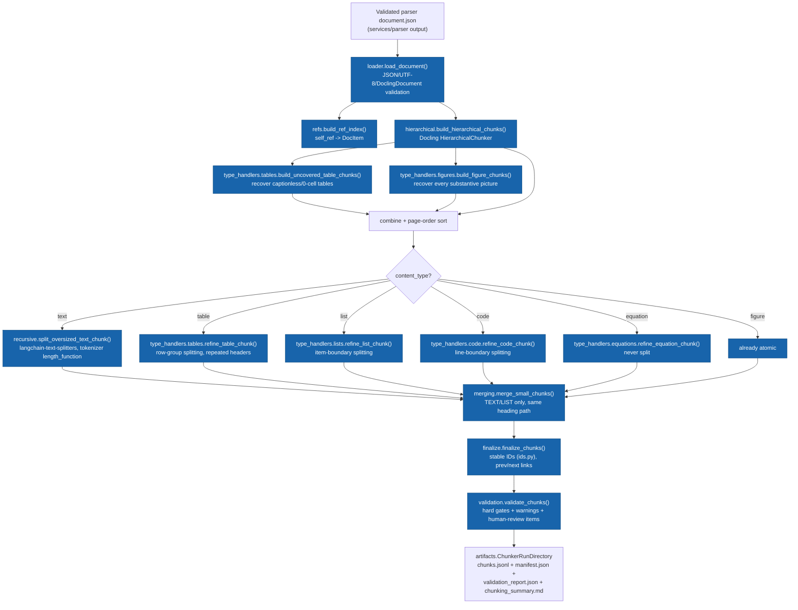

# Chunker Architecture

## Pipeline

## Libraries

| Library | Role |
|---|---|
| `docling_core` | `DoclingDocument` model, `HierarchicalChunker` (structure-aware initial chunking) |
| `transformers` | `AutoTokenizer` — exact tokenizer-based size measurement (`services/chunker/tokenizer.py`) |
| `langchain-text-splitters` | `RecursiveCharacterTextSplitter` — controlled recursive splitting of oversized TEXT chunks only (`services/chunker/recursive.py`) |
| `pydantic` | Typed config (`config.py`) and output models (`models.py`) |

No embedding library, no vector database, no LLM is used anywhere in this
service — see `services/chunker/README.md` and the master prompt's explicit
scope boundary.

## Module map

| Module | Responsibility |
|---|---|
| `loader.py` | Load + validate `document.json`; resolve source identity (sha256, filename) from the sibling `run_manifest.json`/`validation/report.json` when available |
| `refs.py` | `self_ref -> DocItem` index, built once per document |
| `hierarchical.py` | Wraps Docling's `HierarchicalChunker`; classifies each resulting chunk's `content_type` |
| `type_handlers/tables.py` | Row-aware table splitting + recovery of tables `HierarchicalChunker` silently drops |
| `type_handlers/figures.py` | Recovery of every substantive picture (captioned or not) as a FIGURE chunk |
| `type_handlers/lists.py`, `code.py`, `equations.py` | Item/line-boundary splitting; equations are never split |
| `recursive.py` | Conditional recursive splitting — TEXT only, only when oversized |
| `merging.py` | Safe small-sibling merging — TEXT/LIST only, same heading path, provably safe |
| `linking.py`, `ids.py` | Deterministic provisional/final chunk identifiers (no UUIDs) |
| `finalize.py` | Assigns final `chunk_index`, IDs, previous/next links |
| `validation.py` | Hard gates, warnings, human-review items — see `VALIDATION.md` |
| `artifacts.py` | Immutable, timestamp-named run directories; atomic writes |
| `summary.py` | `chunking_summary.md` rendering |
| `service.py` | `ChunkerService` — orders every stage above |
| `config.py`, `models.py` | Public config contract; output/manifest/report models — see `CONFIGURATION.md`, `OUTPUT_SCHEMA.md` |

## Why two services never import each other

`services/chunker` depends only on `docling_core` (the document *model*),
never on `docling` (the conversion *engine* — models, backends, OCR). This
means a Docling upgrade that changes conversion internals cannot break the
chunker, and the chunker cannot accidentally re-convert a PDF. Enforced by
`tests/unit/test_architecture.py::TestPackageIsSelfContained` (two dedicated
checks: `docling` conversion imports confined to the parser; `docling_core`
shared but never `docling` itself in the chunker).

See also: `docs/architecture/service_architecture.md` for the whole-project
service architecture (this is one leaf of that tree).
