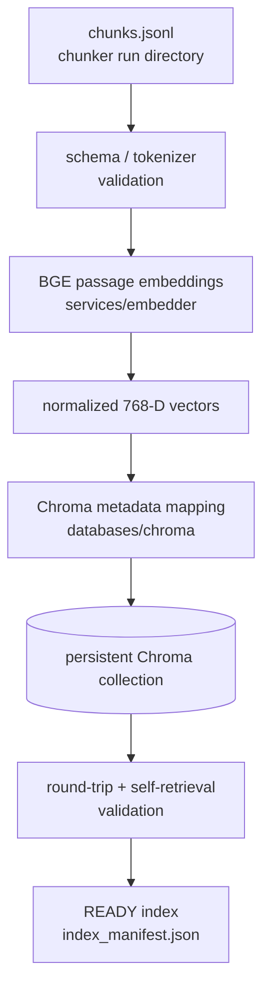

# Indexing Architecture

Two deliberately separate services, connected only through one pipeline and
one CLI — the same pattern the parser and chunker milestones established.



## Module boundaries

```text
src/engineering_rag/
├── services/embedder/           embedding service — no ChromaDB import anywhere
│   ├── __init__.py               public interface
│   ├── config.py                  EmbedderConfig (frozen, extra="forbid")
│   ├── errors.py                   EmptyQueryError, ModelLoadError, VectorValidationError
│   ├── models.py                    ModelInfo, EmbeddingRecord, EmbeddingBatchStats
│   ├── interface.py                  EmbeddingService (typed ABC)
│   ├── validation.py                  validate_vector() — shared by every implementation
│   └── bge.py                          BGEEmbeddingService (production, sentence-transformers)
├── databases/chroma/             Chroma adapter — no sentence-transformers import anywhere
│   ├── __init__.py                public interface
│   ├── config.py                   ChromaConfig, validate_collection_name()
│   ├── errors.py                    CollectionMismatchError, DuplicateIdConflictError
│   ├── models.py                     CollectionIdentity, IngestionOutcome
│   ├── client.py                      get_client() — persistent client factory
│   ├── collection.py                   open_or_create_collection(), rebuild_collection()
│   ├── metadata.py                      chroma_safe_metadata()
│   ├── repository.py                     ingest_batch(), content_hash() — idempotency
│   └── validation.py                      round_trip_check(), self_retrieval_check()
├── pipelines/
│   ├── indexing_config.py         IndexingConfig — composes EmbedderConfig + ChromaConfig
│   ├── indexing_models.py          IndexManifest, IndexValidationReport, gate models
│   ├── indexing_artifacts.py        IndexRunDirectory — atomic per-run report writes
│   ├── indexing_validation.py        build_validation_report() — the 12-gate suite
│   └── indexing_pipeline.py           IndexingService — the ONLY module importing both
│                                       services/embedder AND databases/chroma
└── api/
    └── index_cli.py                engrag-index — argument parsing/presentation only
```

## Responsibilities

**Embedding service** (`services/embedder/`): loads the model, reports its
own identity (dimension, tokenizer, device, resolved revision), embeds
passages and queries with the correct prefix behaviour, validates every
vector it produces (dimension, finiteness, non-zero, normalization) before
returning it. It has no idea a database exists — its typed `EmbeddingRecord`
output is a plain `(chunk_id, list[float])` pair.

**Chroma adapter** (`databases/chroma/`): owns the persistent client, collection
lifecycle (create/open with identity-compatibility enforcement, destructive
rebuild gated behind an explicit flag), Chroma-safe metadata encoding, and
idempotent batch ingestion. It accepts already-computed vectors — it never
imports `sentence-transformers` and has no idea BGE exists.

**Indexing pipeline** (`pipelines/indexing_pipeline.py`): the only module that
imports both of the above. Loads a chunker run, runs admission checks
(schema, chunker-validation status, tokenizer match, no-silent-truncation),
embeds, maps metadata, writes to Chroma, validates the stored result, and
produces the four output-contract files (`index_manifest.json`,
`ingestion_report.json`, `index_validation_report.json`, `index_summary.md`).

**CLI** (`api/index_cli.py`): `build` / `inspect` / `validate` / `list` /
`smoke-query`, argument parsing and Rich console rendering only — every
`app.command()` handler's body is a call into `run_indexing_pipeline()` or a
direct read of a Chroma client/report, never business logic.

## Why the split

Same reasoning as the parser/chunker boundary: the embedding model and the
vector database are two independently swappable pieces of technology. A
future change of embedding model (a genuine incompatibility, not a whim —
see `EMBEDDING_MODEL_DECISION.md`) should never require touching Chroma code,
and a future change of vector database should never require touching
embedding code. The one place that knows about both is the pipeline, and it
is a thin orchestrator, not where either piece's logic lives.

## What this milestone explicitly does not build

No retrieval API, no hybrid search, no BM25, no cross-encoder reranking, no
answer generation, no chatbot. `smoke-query` exists solely to prove that a
completed index is queryable at all — it is explicitly labelled diagnostic
in its own CLI output and is not a retrieval interface.
