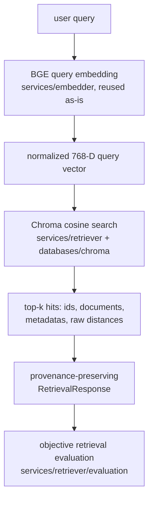

# Retrieval Architecture

Vector retrieval sits on top of the already-complete indexing milestone,
querying the same persistent Chroma collection with the same embedding model
and vector space. Two independent layers, connected only through one
pipeline and one CLI — the same pattern the parser, chunker and indexing
milestones established.



## Module boundaries

```text
src/engineering_rag/
├── services/retriever/            domain retrieval logic — no chromadb import anywhere
│   ├── __init__.py                 public interface
│   ├── config.py                    RetrievalSearchConfig, RetrievalEvaluationConfig
│   ├── errors.py                     typed exception vocabulary
│   ├── models.py                      RetrievalRequest/Hit/Response/Diagnostics,
│   │                                   RetrievalEvaluationCase/Result/Summary
│   ├── filters.py                      metadata filter validation -> Chroma `where`
│   ├── retriever.py                     VectorRetriever.search() — the core flow
│   └── evaluation/                       dataset.py, metrics.py, runner.py
├── services/embedder/              REUSED UNCHANGED — embed_query() already
│                                    implements the BGE query instruction, dimension
│                                    validation, normalization, and empty-query checks.
├── databases/chroma/                REUSED UNCHANGED — get_client(), and
│                                    client.get_collection() (never get_or_create).
├── pipelines/
│   ├── retrieval_config.py          RetrievalConfig — composes EmbedderConfig
│   │                                 + ChromaConfig + RetrievalSearchConfig
│   │                                 + RetrievalEvaluationConfig
│   ├── retrieval_artifacts.py        RetrievalRunDirectory — atomic per-run writes
│   └── retrieval_pipeline.py          the ONLY module importing both
│                                       services/retriever AND databases/chroma
└── api/
    └── retrieve_cli.py               engrag-retrieve — argument parsing/presentation only
```

## Why vector retrieval comes before reranking

This milestone deliberately stops at single-stage cosine vector search. A
cross-encoder reranker, BM25/hybrid fusion, or an LLM-based answer layer all
assume a working, *measured* first-stage retriever underneath them — without
an honest baseline (this milestone's evaluation numbers), it is impossible to
tell whether a later reranker is actually improving results or just adding
latency. The scope boundary is enforced by `test_architecture.py`-style
checks and this document: no BM25, no fusion, no cross-encoder, no LLM
generation code exists anywhere in this package tree.

## Query embedding vs. passage embedding

Both use the same model (`BAAI/bge-base-en-v1.5`, same pinned revision, same
768-dimensional normalized output space) so query and passage vectors are
comparable — but they are **not** embedded the same way:

- **Passages** (indexed once, at build time): embedded with `document_prefix`
  (empty string for this model) — see `services/embedder/bge.py:embed_passages`.
- **Queries** (embedded once per search, at query time): embedded with the
  literal BGE query instruction
  `"Represent this sentence for searching relevant passages: "`, applied
  **exactly once** — see `services/embedder/bge.py:embed_query`, reused
  unchanged by `VectorRetriever`. `services/retriever/retriever.py` never
  re-applies or duplicates this prefix; it calls `embedder.embed_query(text)`
  with the raw query text.

## Chroma distance vs. similarity

Chroma's `query()` always returns a **distance**, never a similarity. This
adapter's collection is configured `hnsw:space="cosine"`, and empirical
verification against the installed `chromadb==1.5.9` (`docs/retrieval/EVALUATION.md`
records the exact check) confirms:

```text
raw_distance = 1 - cosine_similarity(query_vector, stored_vector)
```

`RetrievalHit.raw_distance` is always Chroma's native value. `similarity_score
= 1 - raw_distance` is computed **only** after `VectorRetriever` confirms the
collection's stored `distance_metric` metadata is `"cosine"` — for any other
metric, `similarity_score` is `None` and a warning is attached, never a
silently wrong number.

## Retrieval never mutates storage

`VectorRetriever` and `pipelines/retrieval_pipeline.open_collection_readonly`
only ever call `client.get_collection()` (never `get_or_create_collection`)
and `collection.query()` / `collection.count()` / `collection.get()` — no
`add`, `upsert`, or `delete` call exists anywhere in this package tree. A
missing database path or collection is a hard `CollectionNotFoundError`,
never a silently created empty one.

## Metadata filters: what is and isn't supported

Chroma's `where` clause matches scalar (`str | int | float | bool`) equality
against stored metadata. Several stored chunk fields
(`page_numbers`, `heading_path`, `source_element_refs`) are JSON-encoded
strings (see `databases/chroma/metadata.py`), so they **cannot** be expressed
as native Chroma list-membership filters. `services/retriever/filters.py`
refuses any filter field outside the profile's
`search.allowed_metadata_filter_fields` list with an explicit
`InvalidFilterError` — it never silently ignores an unsupported filter or
fabricates client-side list search.

## Next milestone

BM25/hybrid retrieval and reciprocal-rank fusion, evaluated against this
milestone's same ground-truth dataset and metrics so the improvement (or
regression) from adding a second retrieval signal is measurable, not assumed.
