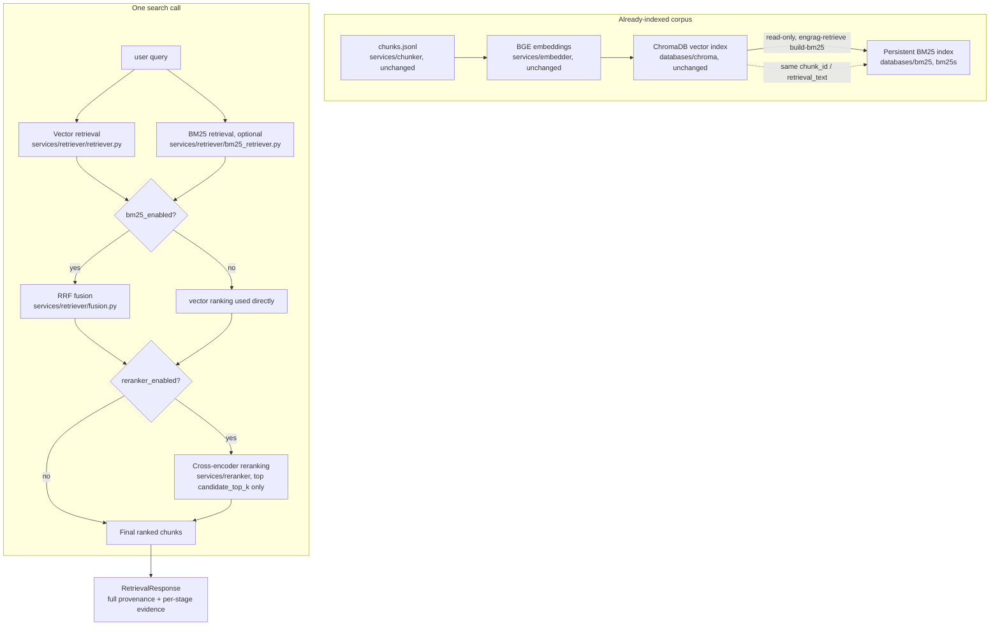

# Hybrid Retrieval + Optional Cross-Encoder Reranking — Architecture

Extends the vector-only retrieval milestone (`docs/retrieval/ARCHITECTURE.md`)
with two independently-toggleable stages: BM25 lexical fusion and
cross-encoder reranking. Vector retrieval remains the required base
retriever in every mode — it is never disabled.

**BM25 does not create chunks.** The existing chunker
(`services/chunker/`) remains the only component that creates chunks. BM25
is a second *ranking signal* over the identical chunks the vector index
already searches — never a second corpus.

## Pipeline



`pipelines/retrieval_pipeline.py::HybridRetriever` is the only module that
constructs both a Chroma collection object and a `BM25IndexHandle` for one
search — it never imports `chromadb` or `bm25s` types beyond that
composition role, mirroring how `VectorRetriever` never imports `chromadb`.

## Module boundaries (additions this milestone)

```text
src/engineering_rag/
├── databases/
│   └── bm25/                         NEW — the only module importing bm25s
│       ├── config.py                  BM25Config
│       ├── models.py                   BM25CorpusRecord, BM25Manifest, BM25RawHit
│       ├── tokenizer.py                 engineering-identifier-aware tokenizer
│       ├── errors.py                     BM25IndexNotFoundError, CorpusValidationError
│       └── index.py                       build_bm25_index(), load_bm25_index()
├── services/
│   ├── retriever/                    EXTENDED
│   │   ├── bm25_retriever.py          NEW — BM25Retriever.search()
│   │   ├── fusion.py                   NEW — reciprocal_rank_fusion()
│   │   ├── corpus_compat.py             NEW — check_corpus_compatibility()
│   │   ├── models.py                     EXTENDED — RetrievalHit/-Response carry
│   │   │                                  per-stage rank/score fields, all optional
│   │   └── retriever.py                   EXTENDED — SearchableRetriever protocol
│   └── reranker/                     NEW — the only module importing CrossEncoder
│       ├── config.py                  RerankerConfig
│       ├── models.py                   RerankCandidate, RerankResult
│       ├── interface.py                 Reranker protocol
│       └── cross_encoder.py              CrossEncoderReranker (BAAI/bge-reranker-base)
└── pipelines/
    └── retrieval_pipeline.py         EXTENDED — HybridRetriever orchestrator,
                                        build_bm25_index_pipeline(), run_hybrid_search()
```

## Why BM25 helps engineering identifiers

A bi-encoder (BGE) embeds a query and a passage independently into one
vector space and compares them by cosine distance — it captures *semantic*
similarity ("what is this about") but has no mechanism to guarantee an exact
token like `PT-101`, `IEC 61511`, or `FT_203` survives contact with the
embedding model unchanged; a rare alphanumeric tag can end up embedded
closer to unrelated text than to the one chunk that literally contains it.
BM25 is a *lexical* ranker: it scores exact (tokenized) term overlap,
weighted by how rare that term is across the corpus (IDF) — so a document
containing the literal string `PT-101` ranks highly for a `PT-101` query
regardless of what the surrounding text "means." The two signals are
complementary, not redundant: vector search finds paraphrases and conceptual
matches BM25 cannot; BM25 finds exact identifiers and technical vocabulary
vector search can dilute.

## Why RRF, not raw-score mixing

Cosine similarity (`[-1, 1]`, bounded) and a BM25 score (unbounded,
corpus-dependent) live on unrelated numeric scales — adding or averaging
them directly produces a number with no defensible meaning (`0.7 + 12.4` is
not "1.1x as relevant" than either input alone). Reciprocal Rank Fusion
avoids this by using each ranking's **rank position**, the one thing both
lists share a comparable scale for:

```text
RRF(document) = sum over each list containing it of  1 / (rrf_k + rank_in_that_list)
```

`rrf_k` (default `60`, the value from the original Cormack et al. RRF paper
and its common reuse in production hybrid search systems) dampens the
influence of a document's exact rank — a document ranked 1st vs. 3rd in one
list changes its score less than raw-score mixing would let a single
strong/weak score dominate. A document appearing in only one list is scored
from that list alone; if BM25 is disabled, RRF never runs at all — the
vector ranking is used directly rather than fusing a real list against an
empty one.

## Why the cross-encoder only reranks a small candidate set

A cross-encoder scores a query and a document **jointly** (concatenated as
one input, not embedded independently), which lets it capture interaction
effects a bi-encoder's independent embeddings cannot — at the cost of
requiring one full forward pass *per candidate, per query* instead of one
cached passage embedding reused across every query. Reranking the entire
122-chunk collection on every query would multiply query latency by roughly
the collection size; reranking only the top `candidate_top_k` (default 20)
candidates that vector/BM25/fusion already judged most likely relevant
captures nearly all of the accuracy benefit at a small, bounded, constant
cost.

## Expected accuracy/latency trade-off

| Mode | Extra signal | Extra cost |
|---|---|---|
| `vector` | — | baseline (~60-100ms, CPU, this corpus) |
| `hybrid` | exact lexical matches via BM25 + RRF | +1-10ms (BM25 is a fast local score, no model) |
| `vector-rerank` | joint query-document scoring | +several seconds (cross-encoder forward passes, CPU) |
| `hybrid-rerank` | both | vector + BM25 cost, plus reranking cost |

See `docs/retrieval/EVALUATION.md` for the measured (not assumed) numbers
from this milestone's real evaluation runs.

## Bi-encoder vs. cross-encoder, semantic vs. lexical — summary

|  | Bi-encoder (BGE, `services/embedder`) | Cross-encoder (`services/reranker`) | BM25 (`databases/bm25`) |
|---|---|---|---|
| Input | Query and passage embedded **separately** | Query and passage scored **jointly** | Tokenized term overlap |
| Captures | Semantic/paraphrase similarity | Fine-grained query-document interaction | Exact lexical/identifier matches |
| Cost per query | One embedding + a vector-index lookup (fast, scales to large corpora) | One forward pass per candidate (slow, only small candidate sets) | One sparse dot-product per document (fast) |
| Where used here | Base retrieval, every mode | Optional final-stage reranking | Optional lexical fusion signal |

## Corpus consistency (non-negotiable)

Hybrid and hybrid-rerank modes call
`services/retriever/corpus_compat.py::check_corpus_compatibility()` before
running any query. It compares the live Chroma collection against the
persisted BM25 manifest on: collection name, record count, the full
`chunk_id` set, `document_id` set, `source_filename` set, `content_hash` per
shared id, and `chunk_schema_version`. Any mismatch raises
`CorpusCompatibilityError` and the search does not run — hybrid search never
silently fuses rankings computed over two different versions of the corpus.

## Limitations (stated once here; repeated honestly in every evaluation report)

- BM25 improves lexical/identifier matching but has no notion of meaning.
- Vector retrieval can under-rank a rare exact identifier a bi-encoder never
  learned to treat as distinctive.
- RRF combines two rankings; it does not itself judge relevance.
- Cross-encoder reranking is materially slower than vector or BM25 retrieval
  on CPU — it is bounded by `candidate_top_k`, not run over the full corpus.
- `RerankResult.score` / `RetrievalHit.reranker_score` are raw model outputs,
  not calibrated probabilities.
- Every evaluation label in `data/eval/retrieval_ground_truth.jsonl` remains
  `human_review_status: "machine_candidate"` — see `EVALUATION.md`.
- A single ~20-query benchmark is directional evidence, not a statistically
  powered guarantee, for any of the four modes.
